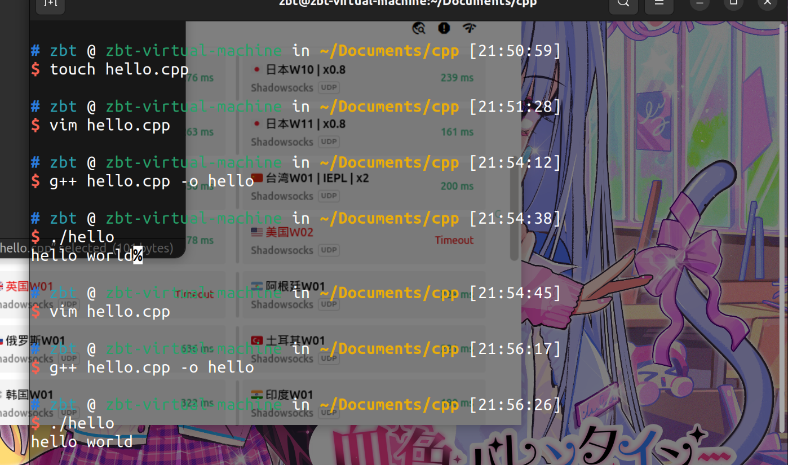

# 凶猫の虚拟机c++之旅（开摆）

## 2023.10.19

- touch 创建文件
- vim 打开
- 按i开始编辑，esc退出编辑
- :wq退出
- g++ 文件名 -o 输出文件
- ./输出文件 查看

## 2023.10.16

- hello world

  

      
新建，打开，编译，输出

      

          
      

  

  
  <!--
  
  
  
  -->
