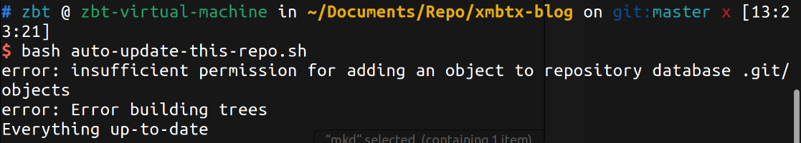
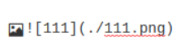

# 凶猫不太凶の虚拟机之旅

## 2023.10.28 系统自启项不要乱改

- 五天不见，mua的前两天把虚拟机的一个自启项关了之后就连不上网了，今天开完就好了，难蚌

## 2023.10.23 c转d二战

- 上次转盘因为奇奇怪怪的原因导致上传功能一直有问题，今天复制后开机选择的移动该虚拟机（另外一个是复制虚拟机，好像不用选那个因为你是在同一个电脑上不同盘的移动不影响网络配置）
- 目前一切正常(一会好一会坏的真服了)
- 本日最后一次上传！

## 2023.10.22 忘了说了，昨天那玩意后来又不能正常上传了

- 不知道为啥昨天复制过去的虚拟机又不能正常上传了，开摆！大不了直接用原来的就是了

  <details>
       <summary>报错图片</summary>
       <p>
           <a href="https://xmbtx.github.io/xmbtx-blog/uploadE.png"></a>
       </p>
   </details>

## 2023.10.21 虚拟机c盘转d盘，上传报错

- 但愿一次成功吧（算成功了吧大概）
- 太抽象了，上传的时候报错connect reset by 20.205.243.166 port 22，could not read from remote repository.
  - 上网搜了一下，说连自己热点（最开始用的本校网络）结果成功了，但是其他用本校网络的人正常上传，离谱
  - [原文链接](https://blog.csdn.net/Wrysmile0308/article/details/128801870?spm=1001.2101.3001.6650.1&utm_medium=distribute.pc_relevant.none-task-blog-2%7Edefault%7EBlogCommendFromBaidu%7ERate-1-128801870-blog-125123963.235%5Ev38%5Epc_relevant_sort_base2&depth_1-utm_source=distribute.pc_relevant.none-task-blog-2%7Edefault%7EBlogCommendFromBaidu%7ERate-1-128801870-blog-125123963.235%5Ev38%5Epc_relevant_sort_base2&utm_relevant_index=2)
  - 回康庄重启后正常
- 太抽象了，又是上传报错修半天结果还不知道咋修好的

## 2023.10.19 md注意事项

- 网站上显示和仓库或typora上的不一样大概率是自己写的问题（多空格少换行等）

## 2023.10.18 一点点心得

- 写作时避免code block套code block的情况，虽然说预览没问题但是高亮的时候可能会出问题
- 对于前面这个实心圈，在typora里是存在空心圈的（mkd小记里标题那块），但是因为渲染引擎的不同可能显示也不一样

## 2023.10.17 连网修复

- 网络报错后续

  靠，为什么上次没搜到这个解决方案
  
```bash  
sudo service NetworkManager stop
  
sudo rm /var/lib/NetworkManager/NetworkManager.state
  
sudo service NetworkManager start
  
```

[原文链接](https://blog.csdn.net/weixin_44126988/article/details/128581200)

## 2023.10.16 更新，载入

   - 更新：

```
bash auto-update-this-repo.sh
```

   - 妈的网络又要手动配置真的服了

     <details>
         <summary>报错图片</summary>
         <p>
             </a>
             </a>
         </p>
     </details>

之前的解决方案：

``` 
sudo dhclient ens33
```

- 图片加载：

  


## 测试区

<!DOCTYPE html>
<html>
<head>
  <style>
    /* CSS 样式用于模态框 */
    .modal {
      display: none;
      position: fixed;
      z-index: 1;
      padding-top: 100px;
      left: 0;
      top: 0;
      width: 100%;
      height: 100%;
      overflow: auto;
      background-color: rgba(0,0,0,0.9);
    }

    /* CSS 样式用于关闭按钮 */
    .close {
      color: #fff;
      float: right;
      font-size: 30px;
      font-weight: bold;
      padding: 10px;
    }
    
    /* CSS 样式用于图片 */
    #modal-image {
      display: block;
      margin: 0 auto;
      max-width: 80%;
      max-height: 80%;
    }
  </style>
</head>
<body>

<!-- 图片链接，点击时触发JavaScript函数 -->
<a href="javascript:void(0);" onclick="openImageModal()">
  
</a>

<!-- 模态框 -->
<div id="image-modal" class="modal">
  <span class="close" onclick="closeImageModal()">&times;</span>
  
</div>


<script>
function openImageModal() {
  var modal = document.getElementById("image-modal");
  var modalImage = document.getElementById("modal-image");
  modal.style.display = "block";
  modalImage.src = "networkW1.png";
}

function closeImageModal() {
  var modal = document.getElementById("image-modal");
  modal.style.display = "none";
}
</script>

</body>
</html>
